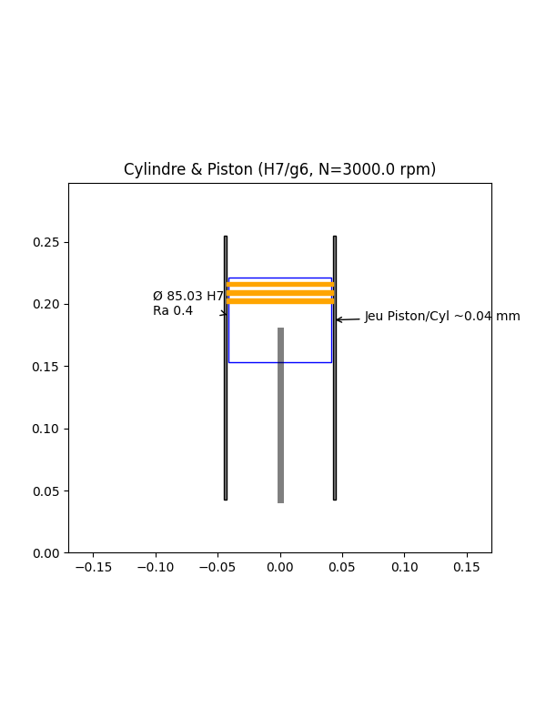
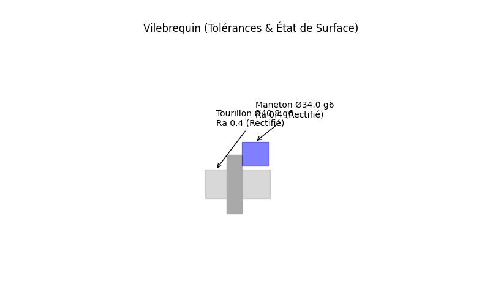
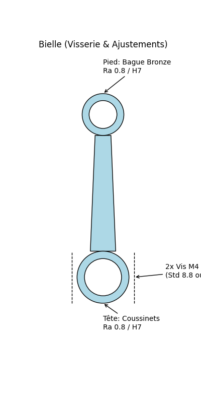

# Rapport de Dimensionnement SHSE-M

## 1. Hypothèses et Entrées
- **Puissance Batterie Cible**: 10.0 kW
- **Régime**: 3000.0 tr/min
- **Fluide**: AIR
- **Pression Moyenne**: 6.0 bar
- **Rendement Global**: 0.152

## 2. Résultats Géométrie
| Paramètre | Valeur | Unité |
|-----------|--------|-------|
| Alésage (B) | 85.0 | mm |
| Course (S) | 85.0 | mm |
| Cylindrée | 483 | cm3 |
| Vit. Piston | 8.50 | m/s |
| Force Max | 9734 | N |

## 3. Détail des Pièces Calculées (Extrait)
Voir `bom.csv` pour la liste exhaustive.

### Piston & Segments
- **Diamètre**: 85.0 mm
- **Axe**: Ø25.5 x 72.3 mm
- **Segments**: 3 x (H=3.40 mm)

### Bielle
- **Entraxe**: 148.8 mm
- **Pied**: Ø38.3 mm
- **Tête**: Ø47.6 mm
- **Vis de Bielle**: M4 (est.)

### Vilebrequin
- **Maneton**: Ø34.0 x 38.3 mm
- **Tourillon**: Ø40.8 mm
- **Recouvrement**: -5.1 mm

## 4. Croquis Techniques

## 5. Vérifications
- **ALERTE: Vitesse piston (8.50 m/s) dépasse la limite (6.0 m/s).**
